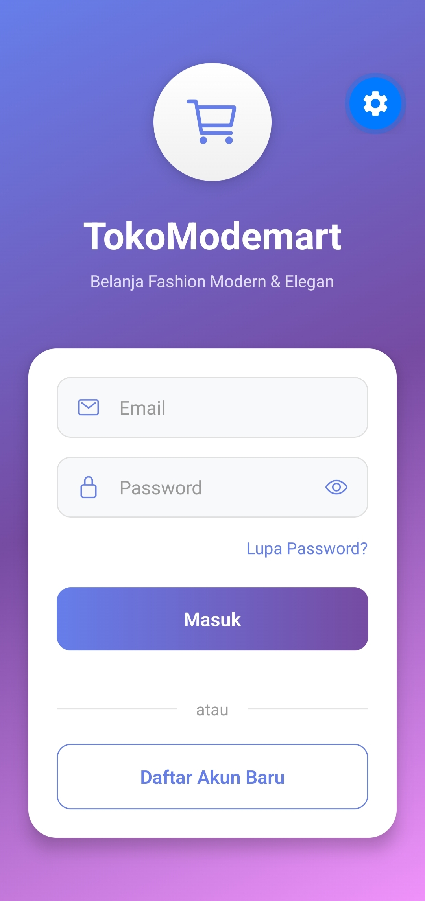
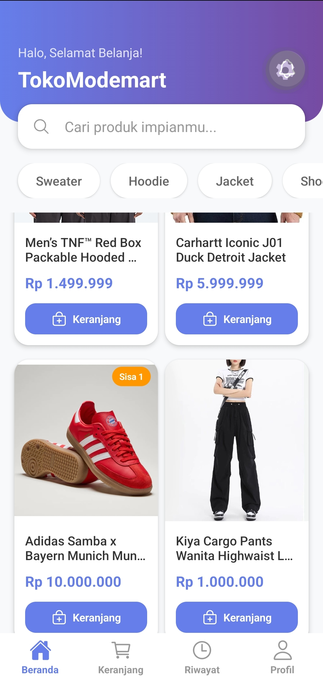
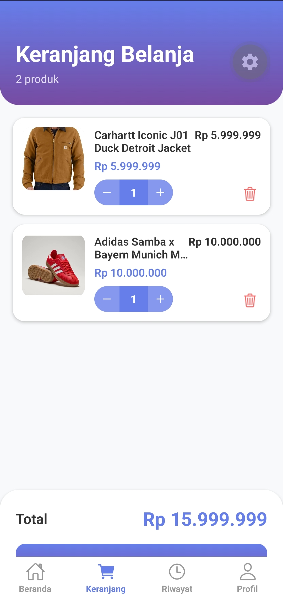
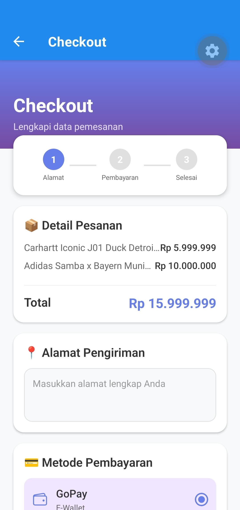
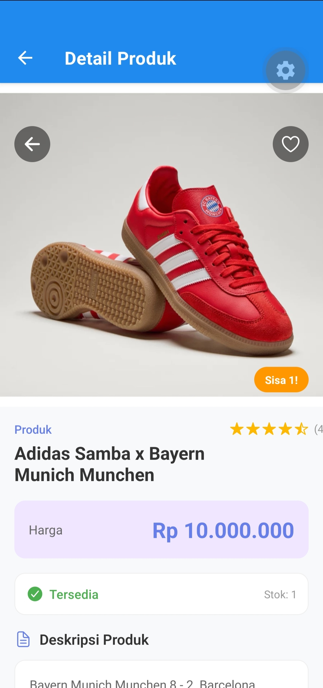
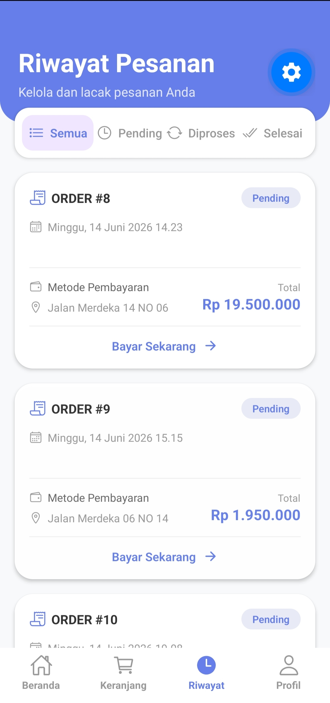
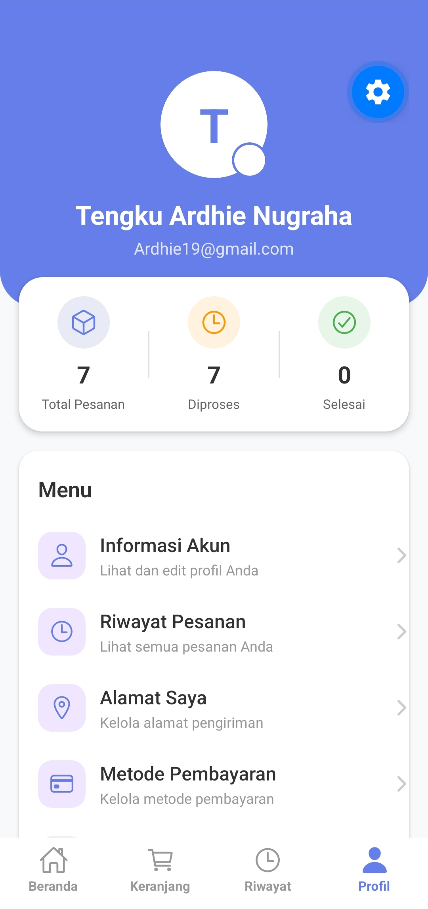

# 🛍️ TokoModeMart - Aplikasi E-Commerce Mobile

**TokoModeMart** adalah aplikasi belanja online modern yang dibangun dengan **Expo** dan **React Native**, menggunakan **TypeScript** untuk memberikan pengalaman berbelanja yang cepat, aman, dan menyenangkan. Aplikasi ini dirancang untuk memudahkan pengguna menemukan dan membeli berbagai produk kebutuhan sehari-hari.

---

## 📱 Tampilan dan Fitur Aplikasi

Berikut adalah setiap halaman yang tersedia dalam aplikasi TokoModeMart beserta penjelasan singkatnya:

---

### 1. Halaman Login / Masuk

| | |
|---|---|
| **Judul Halaman** | Halaman Masuk |
| **Deskripsi** | Halaman awal untuk pengguna melakukan autentikasi. Pengguna dapat memasukkan **Email** dan **Password**, serta menggunakan fitur **Lupa Password** jika diperlukan. Tersedia juga opsi **Daftar Akun Baru** bagi pengguna yang belum memiliki akun. |

**Tampilan:**



> *Jika gambar tidak muncul, pastikan file `IMG_20260621_160414.jpg` sudah di-upload ke repositori*

---

### 2. Halaman Beranda (Home)

| | |
|---|---|
| **Judul Halaman** | Beranda |
| **Deskripsi** | Halaman utama aplikasi yang menyambut pengguna dengan sapaan **"Halo, Selamat Belanja!"**. Halaman ini menyajikan katalog produk dengan tata letak yang bersih dan terstruktur. Pengguna dapat dengan cepat melihat:<br> • **Produk Unggulan**: Menampilkan produk-produk pilihan atau terlaris.<br> • **Kategori**: Ikon kategori seperti **Sweater**, **Hoodie**, **Jacket**, dan **Shoes** untuk memudahkan navigasi.<br> • **Informasi Produk**: Setiap produk ditampilkan dengan gambar, nama, harga, dan tombol **Keranjang** untuk menambahkan produk ke keranjang belanja.<br> • **Fitur Pencarian**: Kolom pencarian untuk mencari produk berdasarkan nama atau kategori. |

**Tampilan:**



> *Jika gambar tidak muncul, pastikan file `IMG_20260621_160517.jpg` sudah di-upload ke repositori*

---

### 3. Halaman Keranjang Belanja

| | |
|---|---|
| **Judul Halaman** | Keranjang Belanja |
| **Deskripsi** | Halaman ini menampilkan semua produk yang telah ditambahkan ke keranjang. Fitur keranjang memungkinkan pengguna mengumpulkan produk yang ingin dibeli sebelum melanjutkan ke proses checkout. Di halaman ini, pengguna dapat:<br> • Melihat daftar produk yang telah dipilih dengan **nama produk** dan **harga**.<br> • Mengubah **jumlah (quantity)** produk dengan tombol (-) dan (+).<br> • Menghapus produk dari keranjang.<br> • Melihat **Total** harga semua produk sebelum checkout. |

**Tampilan:**



> *Jika gambar tidak muncul, pastikan file `IMG_20260621_160502.jpg` sudah di-upload ke repositori*

---

### 4. Halaman Checkout

| | |
|---|---|
| **Judul Halaman** | Checkout |
| **Deskripsi** | Halaman ini digunakan untuk menyelesaikan proses pemesanan. Proses pembayaran dirancang semudah mungkin dengan tiga langkah: **Alamat**, **Pembayaran**, dan **Selesai**. Di halaman ini, pengguna dapat:<br> • Melihat **Detail Pesanan** (daftar produk dan total harga).<br> • Mengisi form **Alamat Pengiriman**.<br> • Memilih **Metode Pembayaran** yang tersedia (misalnya GoPay). |

**Tampilan:**



> *Jika gambar tidak muncul, pastikan file `IMG_20260621_160717.jpg` sudah di-upload ke repositori*

---

### 5. Halaman Detail Produk

| | |
|---|---|
| **Judul Halaman** | Detail Produk |
| **Deskripsi** | Halaman ini menampilkan informasi lengkap tentang suatu produk, termasuk **nama produk**, **harga**, **stok tersedia** (misalnya "Sisa 1!"), dan **deskripsi produk**. Pengguna dapat melihat ketersediaan stok sebelum memutuskan untuk membeli. |

**Tampilan:**



> *Jika gambar tidak muncul, pastikan file `IMG_20260621_160726.jpg` sudah di-upload ke repositori*

---

### 6. Halaman Riwayat Pesanan

| | |
|---|---|
| **Judul Halaman** | Riwayat Pesanan |
| **Deskripsi** | Halaman ini menampilkan daftar semua pesanan yang telah dilakukan oleh pengguna. Setiap pesanan menampilkan **nomor pesanan (ORDER #)** , **tanggal pemesanan**, **metode pembayaran**, **alamat pengiriman**, dan **total harga**. Pengguna juga dapat menekan tombol **Bayar Sekarang** untuk pesanan yang masih menunggu pembayaran. |

**Tampilan:**



> *Jika gambar tidak muncul, pastikan file `IMG_20260621_160447.jpg` sudah di-upload ke repositori*

---

### 7. Halaman Profil Pengguna

| | |
|---|---|
| **Judul Halaman** | Profil Pengguna |
| **Deskripsi** | Halaman ini menampilkan informasi profil pengguna, termasuk **nama** dan **email**. Pengguna dapat melihat ringkasan pesanan (**Total Pesanan**, **Diproses**, **Selesai**) serta mengakses menu pengaturan seperti:<br> • **Informasi Akun**: Lihat dan edit profil.<br> • **Riwayat Pesanan**: Lihat semua pesanan.<br> • **Alamat Saya**: Kelola alamat pengiriman.<br> • **Metode Pembayaran**: Kelola metode pembayaran. |

**Tampilan:**



> *Jika gambar tidak muncul, pastikan file `IMG_20260621_160434.jpg` sudah di-upload ke repositori*

---

### 8. Navigasi Bawah (Bottom Navigation)

| | |
|---|---|
| **Judul Halaman** | Bottom Navigation |
| **Deskripsi** | Di setiap halaman utama, terdapat navigasi bawah yang memudahkan pengguna berpindah antar halaman:<br> • **Beranda** - Kembali ke halaman utama.<br> • **Keranjang** - Melihat keranjang belanja.<br> • **Riwayat** - Melihat riwayat pesanan.<br> • **Profil** - Mengelola akun pengguna. |

**Tampilan:** Terlihat di bagian bawah setiap screenshot halaman aplikasi

---

## 🚀 Cara Menjalankan Aplikasi

Untuk menjalankan proyek ini di lingkungan pengembangan lokal, ikuti langkah-langkah berikut:

**Prasyarat**
Pastikan Anda telah menginstal **Node.js** dan **npm** atau **yarn** di komputer Anda.

**Langkah Instalasi**

1.  **Clone Repository**
    ```bash
    git clone https://github.com/Ardhie14/TokoModeMart.git
    cd TokoModeMart
